# VUE 관통 PJT
> **기간:** 2024-11-04 ~ 2024-11-17
> 
> **팀 구성:** 김지윤, 나혜원  
> 
> **소속:** 서울 9반
<br/>

## I. Introduction
### 프로젝트 소개
- 프로젝트 이름: FITPASS
- 목적: FITPASS는 FITNESS와 PASSPORT의 결합어로, 사용자가 운동과 여행의 경험을 디지털 여권 형태로 기록하고 공유할 수 있는 서비스를 제공합니다.
- 주요 기능:
    - 운동 기록: 여행 중 방문한 피트니스 센터, 운동 장소, 또는 액티비티를 기록할 수 있습니다.
    - 여행 기록: 여행지에서의 활동과 경험을 상세히 기록 및 저장할 수 있습니다.
    - 커뮤니티: 사용자가 서로의 여정을 공유하고, 영감을 받을 수 있는 커뮤니티 공간을 제공합니다.
    - 개인 대시보드 관리: 자신의 운동 목표와 여정을 시각적으로 관리할 수 있는 사용자 대시보드를 제공합니다.
- 예상 사용자:
    - 새로운 액티비티(운동)을 경험하기 위해 여행을 떠나는 사람들.
    - 여행지에서의 독특한 경험을 기록하고자 하는 사람들.
    - 운동과 여행을 결합한 라이프스타일을 지향하는 사람들.
    - 여행 및 운동 경험을 커뮤니티와 공유하고, 다른 사람의 여정을 통해 영감을 얻고자 하는 사람들. 

### 주요 기술 스택:
- Frontend: Vue 3, Vuetify
- 상태 관리: Pinia
- 스타일링: Vuetify, CSS
- 지도 API: Kakao Maps

<br/>

## II. Features
### 프로젝트 디렉토리 구조
```
📦src
 ┣ 📂assets
 ┃ ┣ 📜base.css
 ┃ ┣ 📜login.png
 ┃ ┣ 📜logo.png
 ┃ ┣ 📜logo.svg
 ┃ ┣ 📜main.css
 ┃ ┣ 📜map.jpg
 ┃ ┗ 📜profile.png
 ┣ 📂components
 ┃ ┣ 📂adminpage
 ┃ ┃ ┣ 📜AdminListView.vue
 ┃ ┃ ┣ 📜AdminPageView.vue
 ┃ ┃ ┣ 📜AdminRequestView.vue
 ┃ ┃ ┗ 📜AdminSportView.vue
 ┃ ┣ 📂community
 ┃ ┃ ┣ 📜CommunityPageView.vue
 ┃ ┃ ┣ 📜CommunityPostsView.vue
 ┃ ┃ ┗ 📜FriendListView.vue
 ┃ ┣ 📂main
 ┃ ┃ ┣ 📜AdminDialogCard.vue
 ┃ ┃ ┣ 📜FeaturesSection.vue
 ┃ ┃ ┣ 📜HeaderSection.vue
 ┃ ┃ ┣ 📜MainPageView.vue
 ┃ ┃ ┗ 📜Navbar.vue
 ┃ ┣ 📂myHome
 ┃ ┃ ┣ 📜KaKaoMapView.vue
 ┃ ┃ ┣ 📜MyPageView.vue
 ┃ ┃ ┣ 📜MyPostsView.vue
 ┃ ┃ ┗ 📜MyRecordsView.vue
 ┃ ┣ 📂profile
 ┃ ┃ ┣ 📜ProfileEditView.vue
 ┃ ┃ ┗ 📜ProfileView.vue
 ┃ ┣ 📂write
 ┃ ┃ ┣ 📜KakaoPlaceRegistView.vue
 ┃ ┃ ┗ 📜WritePageView.vue
 ┃ ┣ 📜Login.vue
 ┃ ┣ 📜Logo.vue
 ┃ ┣ 📜MainPage.vue
 ┃ ┗ 📜Singup.vue
 ┣ 📂plugins
 ┃ ┗ 📜vuetify.js
 ┣ 📂router
 ┃ ┗ 📜index.js
 ┣ 📂stores
 ┃ ┣ 📜counter.js
 ┃ ┗ 📜user.js
 ┣ 📂views
 ┃ ┣ 📜AboutView.vue
 ┃ ┗ 📜HomeView.vue
 ┣ 📜.env.local
 ┣ 📜App.vue
 ┗ 📜main.js

```
### 프로젝트 화면
#### 첫 화면
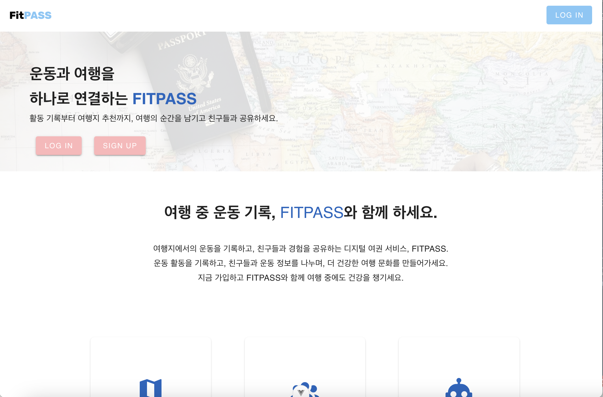
#### 회원가입 페이지
#### 로그인 페이지
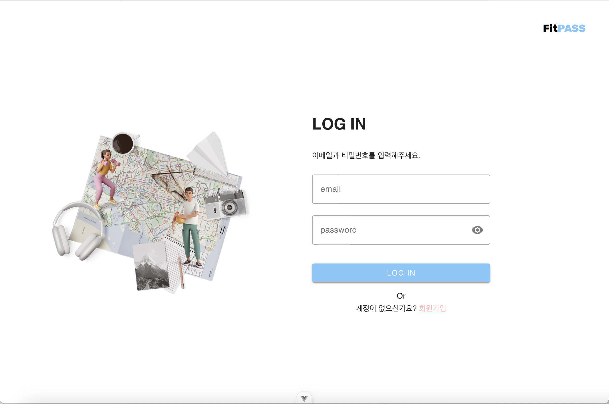
#### 대시보드 페이지
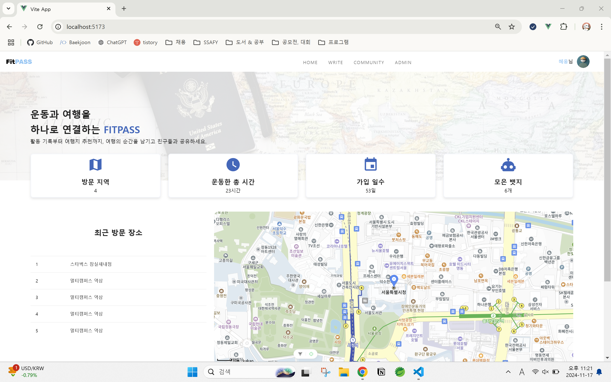<br>
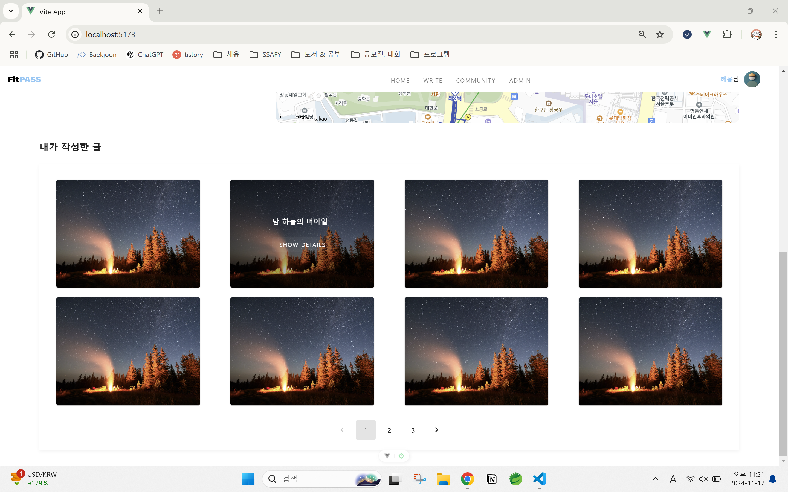<br>
관리자 요청 클릭 시 화면 <br>
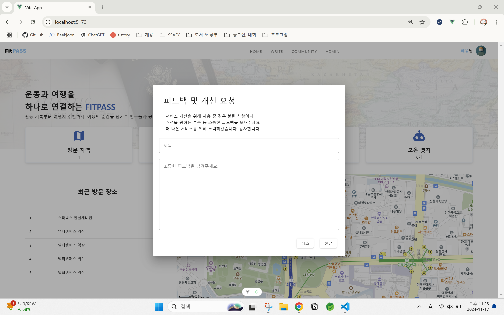
#### 커뮤니티 페이지
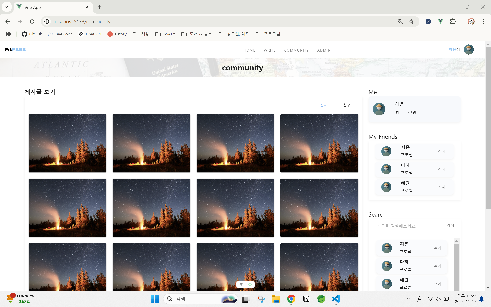
#### 게시글 작성 페이지
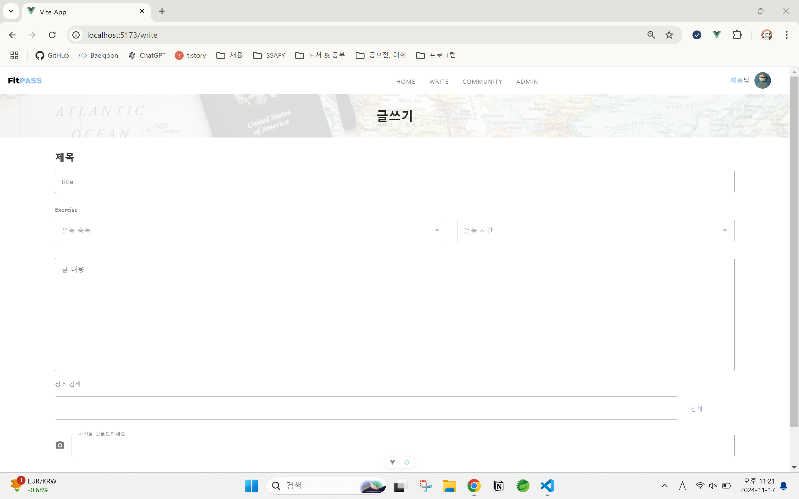 <br>
주소를 입력하고 검색하면 관련 주소가 표시된 지도 이미지가 보입니다.<br>
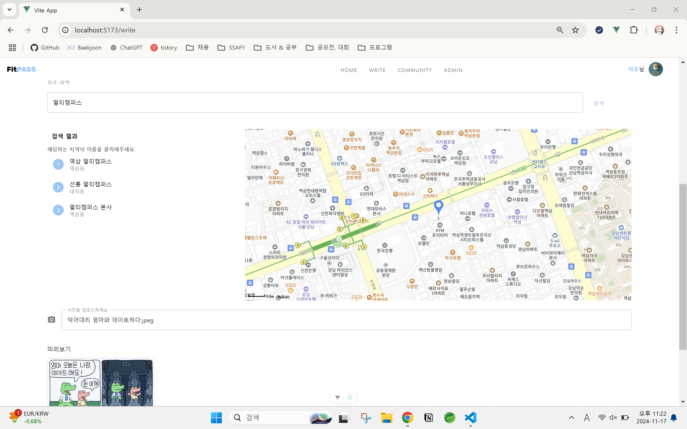
#### 내 정보 페이지
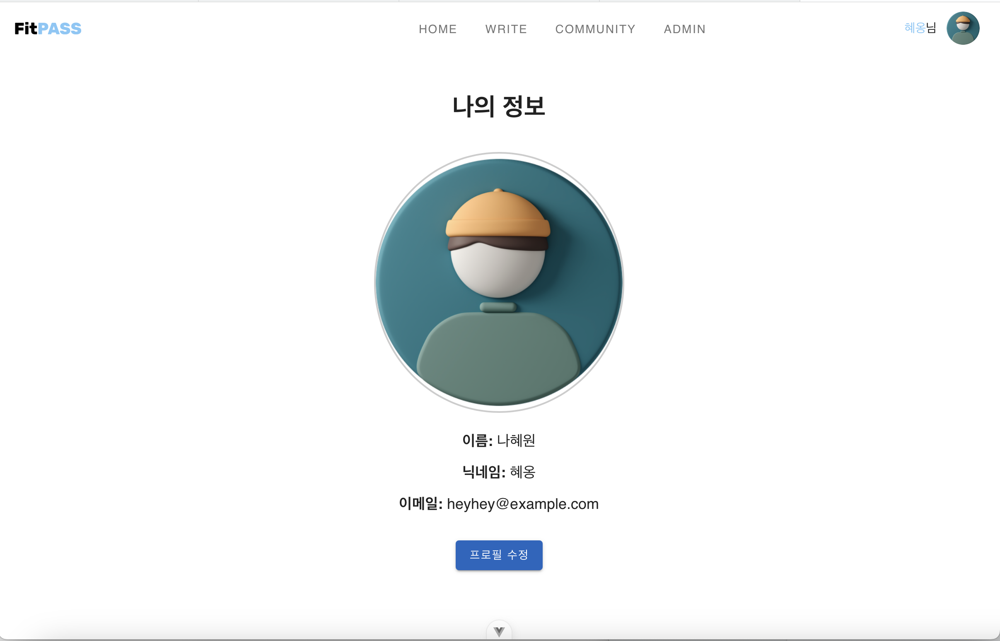
#### 관리자 페이지 - 1
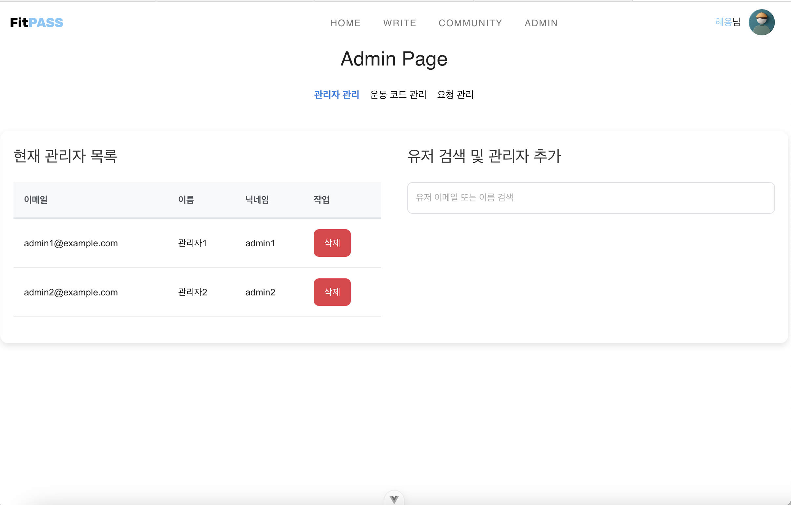
#### 관리자 페이지 - 2
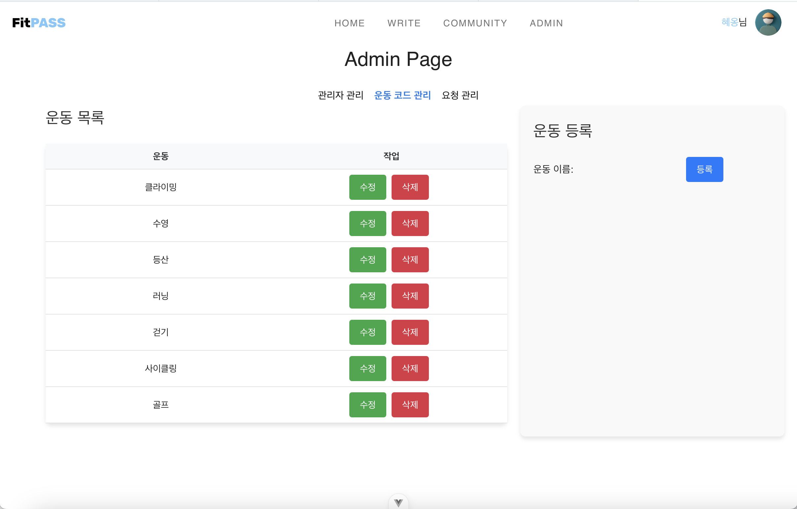
#### 관리자 페이지 - 3
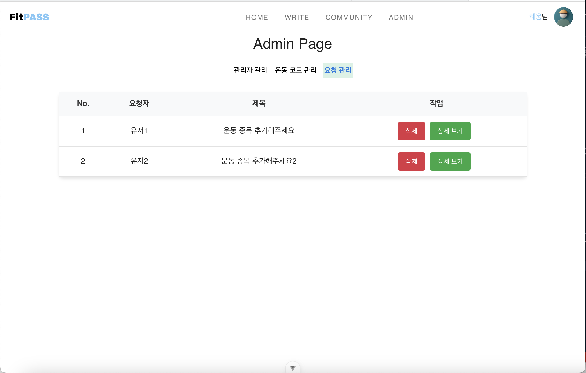

<br/>

## III. 기능 구현

1. 사용자 대시보드 관리

    사용자는 개인 대시보드에서 이전에 방문한 여행지, 운동 장소, 운동한 총 시간 둥울 시각적으로 한 눈에 볼 수 있습니다.
    또한, 지도를 이용해 여행지와 운동 장소를 직관적으로 탐색할 수 있습니다.

2. 게시물 작성 및 커뮤니티 기능

    게시물 작성: 사용자가 글을 작성하여 저장할 수 있습니다. <br/>
    커뮤니티: 작성된 게시물을 다른 사용자와 공유 및 조회할 수 있습니다.
3. 관리자 요청 기능

    사용자는 관리자에게 특정 요청을 보낼 수 있습니다.
4. 친구 기능 

    사용자 검색을 통해 친구 요청을 보낼 수 있으며 친구 목록을 관리할 수 있습니다.


## IV. 프로젝트 회고

### 김지윤
> 요구 사항 분석과 설계부터 직접 주도적으로 진행한 첫 프로젝트라서 특별한 의미였습니다. 
> 자바와 스프링의 기본 개념을 복습하고 심화할 수 있었던 점도 큰 성과였습니다. 
> 특히 백엔드 개발 과정에서, 예외 처리를 설계하며 사용자 경험을 고려한 적절한 에러 메시지 제공 방법에 대해 고민했습니다. 
> 무엇보다 이번 프로젝트에서는 “이건 어떻게 짜야 하지?”라는 질문을 스스로 던지게 되는 경험이 많았습니다. 초기 설계 단계에서 추상적으로 떠올렸던 아이디어들이 구체적으로 코드를 짜는 과정에서 현실화되었고, 이러한 경험은 단순히 지식을 습득하는 것을 넘어, 직접 작성한 코드가 내 것이 되는 순간을 느끼게 해주었습니다. 

### 나혜원 
> 이번 프로젝트를 통해 설계의 중요성을 다시 한 번 깊이 느꼈습니다. 처음에는 설계를 충분히 했다고 생각했지만, 진행 과정에서 수정해야 할 부분이 적지 않았습니다. 특히, 구현보다 설계에 더 많은 시간을 투자하면서 구조적이고 명확한 기반을 다지는 데 집중했는데, 이 점이 프로젝트를 더 의미 있게 만들었다고 생각합니다.

> 모든 과정에서 '왜?'라는 질문을 끊임없이 던지며 각 선택의 이유를 찾으려고 노력했던 것이 쉽지는 않았지만, 그 과정에서 많은 것을 배울 수 있었고, 최종적으로 보람찬 결과를 얻을 수 있었습니다. 이번 경험을 통해 앞으로 더 나은 설계를 고민하며 성장할 수 있을 것 같습니다.


## 추천 IDE 설정  

[VSCode](https://code.visualstudio.com/) + [Volar](https://marketplace.visualstudio.com/items?itemName=Vue.volar) (and disable Vetur).

## Customize configuration

See [Vite Configuration Reference](https://vite.dev/config/).

## 프로젝트 설정 

```sh
npm install
```

### Compile and Hot-Reload for Development

```sh
npm run dev
```

### Compile and Minify for Production

```sh
npm run build
```
